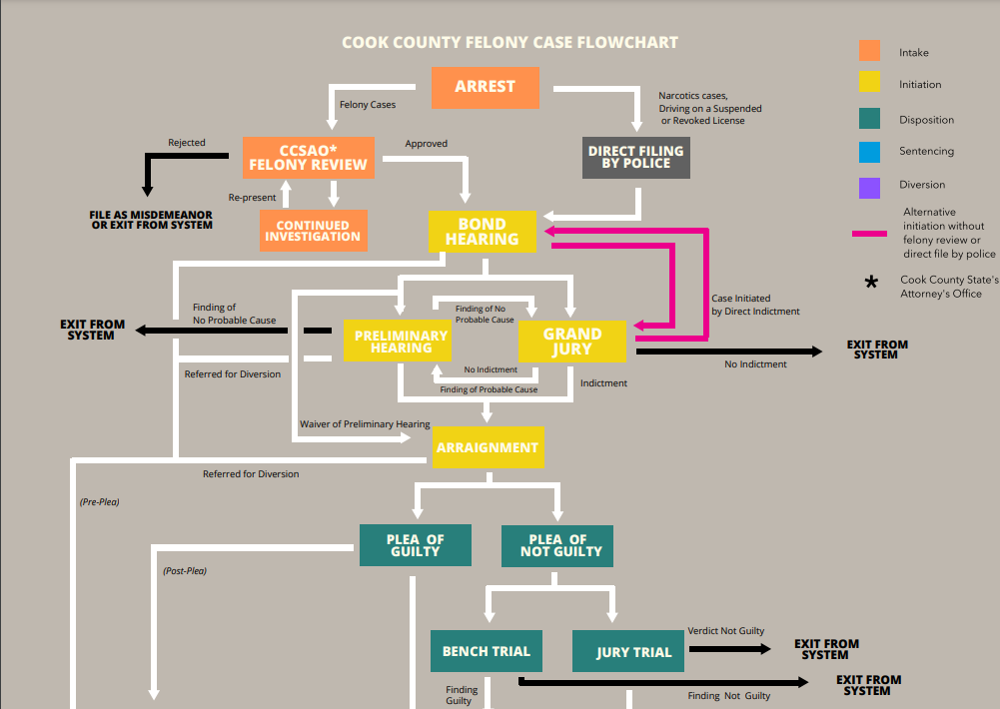

# Data Viz Break-Out Group @ [Chi Hack Night](https://chihacknight.org/)
## Working Group to Sharpen your Data Visualization Skills

### This Month's Dataset
### **[Cook County SAO Felony Intakes](https://datacatalog.cookcountyil.gov/Courts/Intake/3k7z-hchi)**

#### Quick Description
The intake data presented in this data reflects the cases brought in for review. Each row represents a potential defendant in a case.  

#### Related Data to Explore
The CCSAO shares much of their data via the Cook County Data Portal. There is plenty of Related Data that can be found at this [link](https://datacatalog.cookcountyil.gov/browse?category=Courts). 

Before diving into the datasets, I'd familarize yourself with this helpful flowchart ~_provided by the CCSAO's office directly_. 

### About the Group
Each month, we will investigate 1 dataset from [Chicago's Open Data Portal](https://data.cityofchicago.org/) -_a collection of publicly available datasets about Chicago provided by the City of Chicago itself_.  During each meeting, we will explore / clean data, pull out any interesting insights, practice communicating your findings through your own data visualizations and share them with others.

#### Group Rules
There are not many, but just a few to keep us focused on working and learning together.

1. Make sure you're adhering to Chi Hack Night's [Code of Conduct](https://chihacknight.org/code-of-conduct.html#:~:text=Chi%20Hack%20Night%20is%20dedicated,nationality%2C%20age%2C%20or%20religion.) as it will help us keep a great working and learning space for all.

2. Your analysis / visualizations should use our [featured dataset](#-This-Month's-Dataset) in some form. If you find another dataset you want to join or compare it with, go for it! Just make sure you can at least demonstrate how you used our monthly data set.

3. If you are trying to replicate a visualization that you found somewhere, please sure to give credit to the original owner _(or at least the website where you found it)_. Since this is a learning / working group, replicating can be a great way to learn. But please be sure to give credit to the original owner or source of inspiration.

#### Do I Need to Know How to Code to Join
No! Not at all. This working group is open to all prior experiences. Whether you've been coding for years, an excel expert, or new to data and want to learn, this can be a good group for you. Check out the `help_me_get_started` folder in this repo if you're not sure where to start and would like some ideas!

#### Where should I store my work?
I recommend that you store your work in **your own GitHub repository** or somewhere locally on your computer. While you are more than welcome to fork this repo, **you won't be able to store your work in this repo**. If you're new to GitHub, they have a ton of great documentation on how to set up a repo found [here](https://docs.github.com/en/github/creating-cloning-and-archiving-repositories/creating-a-repository-on-github). 

#### What does a meeting look like
Each session is dedicated to being a working space to roll up your sleeves and start analyzing. Each night, we will share some quick hellos, recap how the group works for any new folks, and then start working. Feel free to work by yourself or in teams!

At the end of each meeting, we will save 5 - 10 minutes for questions or sharing in general. _We will also have a slightly longer share-out at the last session for each month for a share-out_

#### Analysis Project Tips
If you are looking for a place to start, I recommend following these steps to help plan out your analysis and data viz: 

1. **Set-Up a Project Doc** -> A GitHub README is a perfect place to start planning out what you'll do. For reference, you are reading one right now. Find out how to make one [here](https://docs.github.com/en/github/creating-cloning-and-archiving-repositories/about-readmes)

2. **Define your Analysis Question(s) in your Project Doc** -> At this early stage, a broad question is actually okay. For example, _"how has Chicago's budget changed over the past 10 years?"_ or _"how is the Chicago Public Library using their budget this year"_, etc.. After you get working, you can always focus in later on. 

3. **Plan what data you'll need to learn more about your question** -> Think about other datasets, but also start considering what you want your **final** table to look like. Is it going to be grouped by something? Do you need to perform calculations on it? 

4. **Look for the datasets that you need** -> If you find them, that's awesome! It's fairly common that you might not find what you need and revisit your analysis question(s). If you need to pivot a bit, that's expected! Don't feel stuck to any one particular path. 

5. **Data Cleaning Plan** -> Sketch out what you want your final table to look like and compare it with the data that's there. Are there any missing values? Are there weird formatting issues you need to fix? Take note of that somewhere in your project doc. 

Admittedly, this step will always look different depending on what your analysis question is. **Asking for advice on best ways to clean data is definitely encouraged!**

6. **Sketch out your visuals (or whatever your final product might be)** -> You want to communicate what you have in a map? Sketch out what it will be filled with. You want to make a pie chart? Sketch out how it will be broken down. I skip this step far too often and I always regret it. There is no bigger waste of time than building out code for something you haven't fully thought through. It's a simple step that will likely save you a lot of time. 

7. **Data Cleaning** -> Start cleaning your data! Whether you are building out code or working excel, start building out code to get to your final dataset that sketched out a couple points back. 

8. **Visualize** -> Start building out what what you sketched out a couple points back!

This is not meant to be a full-proof project plan - just a good foundation to start with! Definitely consider planning / sketching out as much as you can before you actually start writing code or playing around with Excel. It will save you a bunch of time in the long run! 